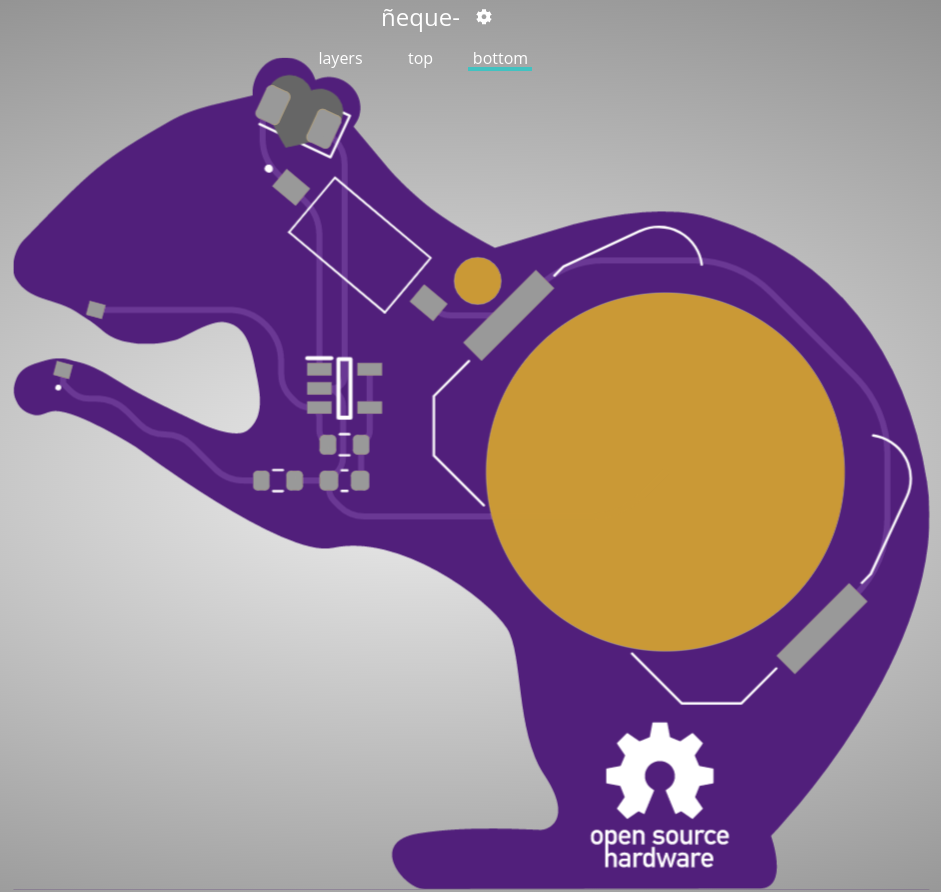

# Agouti (ñeque) PCB 

 

## BOM
- [Heart ears LED (reverse mounted)](https://www.tme.eu/ro/details/ost10807c1c-c/diode-led-speciale-cu-efect/optosupply/)
- [Hands LED (reverse mounted)](https://ro.mouser.com/ProductDetail/ams-OSRAM/LO-P47K-K2M1-24-0-R18-Z?qs=w%2Fv1CP2dgqrUwoZD9cFykg%3D%3D)
- [555 timer](https://ro.mouser.com/ProductDetail/Microchip-Technology-Atmel/MIC1555YM5-TR?qs=Y3Q3JoKAO1QTQn1YTyJaSg%3D%3D)
- [Battery holder](https://ro.mouser.com/ProductDetail/712-BAT-HLD-001)
- [Switch](https://ro.mouser.com/ProductDetail/CUI-Devices/DS04-254-2-01BK-SMT?qs=wnTfsH77Xs7VDGZ8jaePmA%3D%3D)

